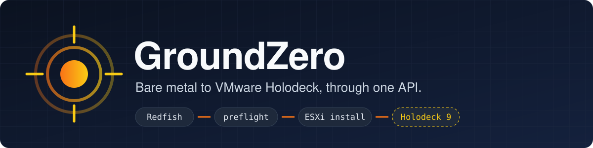
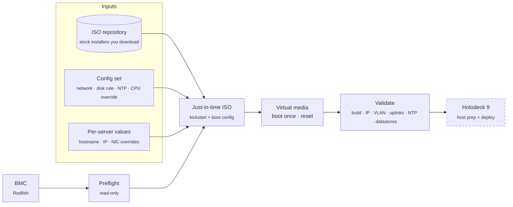

<p align="center">
  
</p>

<p align="center">
  <a href="https://github.com/djsincla/GroundZero/releases"></a>
  <a href="https://github.com/djsincla/GroundZero/actions"></a>
  
  
  
  
  
</p>

<p align="center">
  <b>Point GroundZero at a server's BMC. It checks the hardware, installs ESXi unattended,<br>
  validates the result, and gets the host ready for VMware Holodeck.</b>
</p>

<p align="center">
  <a href="docs/INSTALL.md"><b>Install it for your lab →</b></a>
</p>

---

## Why GroundZero

Building a Holodeck lab usually means an evening of iDRAC consoles, hand-edited kickstarts and
re-burned ISOs. GroundZero turns that into one repeatable, API-driven run:

- **🔌 API-first.** A versioned REST API (`/api/v1`, OpenAPI at `/docs`) does all the work. The CLI,
  the web UI and your automation are clients of that same API.
- **🩺 Preflight before you touch anything.** It reads inventory over Redfish and checks it against the
  Holodeck 9 / VCF 9 requirements: CPU support, memory, disks, NICs and boot mode. Preflight is
  strictly read-only.
- **💿 Unattended OS install.** GroundZero takes a stock ISO from your repository and adds a config
  set, the per-server values and the kickstart, building the result just in time. It then mounts the
  ISO as virtual media, sets a one-time boot and resets the server.
  - When the install finishes, it validates the result: build, IP, VLAN, uplinks, NTP and datastores.
  - The built ISO is always deleted and the media is always ejected.
- **🧩 Config sets, not hard-coded values.** You define network, disk rules, NTP and the CPU override
  once, then reuse them across servers with per-host overrides. A config set can also be
  **captured from a running ESXi host**. The design is OS-agnostic, with a plugin per OS family.
- **🛡️ Safe by default.**
  - Installs need a typed confirmation.
  - VMFS is preserved unless you explicitly ask to wipe it.
  - Credentials are encrypted at rest and never returned by the API.
  - BMC and ESXi TLS certificates are **pinned** on first use, so a changed certificate stops the
    connection before any password is sent.
- **🧪 Functional testing.** A stateful simulator (a Redfish BMC plus ESXi, replayed from real R740xd
  captures, with fault injection) drives black-box tests of the real server, CLI and browser UI.

## How it works



The ISO repository, config sets and hosts stay separate, and they are only merged at deploy time. A
**deploy preview** shows the exact kickstart, with secrets masked, before anything touches the
server.

## Status

| Milestone | Scope | State |
|---|---|---|
| **M1** | API, job model, Redfish client, inventory, Holodeck 9 preflight | ✅ done |
| **M2** | Unattended ESXi 9.x install via virtual media, with CPU override, VMFS preservation and post-install validation | ✅ done: ESXi 9.1.1 on a Dell R740xd |
| **M2.5** | Config sets with capture from a running host, ISO repository, deploy preview, web UI, certificate pinning | ✅ done (UI refresh in progress) |
| M3 | Holodeck host prep (MTU 9000, trunk port groups) and the Holodeck 9 deploy job | ⏳ next |
| M4 | NSX bare-metal Edge plugin, more OEM profiles, API explorer rework | 📋 planned |

## Quick start

**Setting it up for your own lab?** Follow the step-by-step [installation guide](docs/INSTALL.md):
prerequisites, network requirements, native or container install, and every step from preflight to the
Holorouter.

Requires Python 3.12+ and [uv](https://docs.astral.sh/uv/).

```bash
uv sync
cp .env.example .env            # lab credentials (git-ignored, never hard-coded)
uv run groundzero serve         # API on http://127.0.0.1:7182 (+ TLS media server on :443)
uv run groundzero ui            # open the web UI
```

Then, from another terminal:

```bash
# 1. Register the server and check it
uv run groundzero hosts add --bmc 10.0.0.50 --name r740xd      # password is prompted
uv run groundzero preflight r740xd

# 2. Describe the OS you want: capture from a running host, or build one in the UI
uv run groundzero os set r740xd --address 192.0.2.101
uv run groundzero config capture r740xd --name lab-esxi

# 3. Drop stock ISOs into ./images, then install by filename or ISO id
#    (the CLI previews the kickstart and asks for a typed confirmation)
uv run groundzero isos list
uv run groundzero install r740xd --iso VMware-VMvisor-Installer-9.1.1.0.25714478.x86_64.iso --config lab-esxi \
    --hostname esxi1 --ip 192.0.2.101
```

### Or run it as a single container

The REST API, the web UI, the install-media server and the SQLite state ship as **one OCI image**. It
runs with [Podman](https://podman.io) (free and open source, Apache-2.0, with no Docker Desktop licence
needed). [Colima](https://github.com/abiosoft/colima) or Rancher Desktop also work, with
`GZ_ENGINE=docker`.

```bash
brew install podman && podman machine init && podman machine start    # one-time, macOS
scripts/gz-container build
scripts/gz-container up --bmc 198.51.100.11    # detects this machine's address on the route to the BMC
scripts/gz-container ui                      # open the UI, signed in
scripts/gz-container logs | status | token | shell | down
```

- **State** (database, API token, encryption key, certificates) lives in the `groundzero-data`
  volume and survives upgrades and restarts.
- **ISOs** are read from `./images`, mounted read-only.
- **Ports:** the API and UI are published on `127.0.0.1:7182` only. The media server is published on
  `:443`, so the BMC can fetch the install ISO.
- **Media URL:** the BMC fetches media from *this machine* (for example its VPN address), not from
  the container. `up` works that address out from the route to the BMC. Run `up` again if the VPN
  address changes, or set `GROUNDZERO_MEDIA_PUBLIC_URL` yourself.
- **Running both:** stop a native `groundzero serve` first, since they use the same ports, or set
  `GZ_API_PORT` and `GZ_MEDIA_PORT`.

To call the API directly, use the bearer token from `uv run groundzero token show`:

```bash
TOKEN=$(uv run groundzero token show)
curl -s -H "Authorization: Bearer $TOKEN" http://127.0.0.1:7182/api/v1/hosts
```

## API (v1)

| Area | Endpoints |
|---|---|
| Hosts | `GET/POST /hosts`, `GET/DELETE /hosts/{id}` |
| Discovery | `POST/GET /hosts/{id}/inventory`, `POST/GET /hosts/{id}/preflight`, `GET /profiles` |
| Installed OS | `PUT/GET /hosts/{id}/os`, `POST/GET /hosts/{id}/os/network`, `POST /hosts/{id}/os/capture` |
| Config | `GET /os-families`, `GET/POST /config-sets`, `GET/PUT/DELETE /config-sets/{id}`, `GET/PUT /hosts/{id}/host-values/{family}` |
| ISOs | `GET /isos`, `POST /isos/rescan` |
| Install | `POST /hosts/{id}/install/preview`, `POST/GET /hosts/{id}/install` |
| Trust | `GET /hosts/{id}/certificates`, `POST /hosts/{id}/certificates/{role}/trust` |
| Jobs | `GET /jobs`, `GET /jobs/{id}`, `GET /jobs/{id}/events` (SSE), `POST /jobs/{id}/cancel` |

- **Paths:** all are under `/api/v1`. `/healthz` is unauthenticated.
- **Errors:** RFC 9457 `application/problem+json`.
- **Long-running work:** returns `202` and a Job. Each host can run only one job at a time.
- **Local state:** everything lives in `~/.groundzero/` (SQLite, the API token and the encryption
  key). Override the location with `GROUNDZERO_HOME`.

## Security model

| Concern | How it's handled |
|---|---|
| Credentials at rest | Fernet-encrypted in SQLite. Write-only through the API: responses show `has_root_password`, never the value. |
| Credentials in transit | TLS certificates are pinned on first use per host and role (`bmc`, `os`). After a legitimate change (a reinstall, a renewed certificate), re-trust with `groundzero hosts trust HOST bmc\|os`. |
| Install media | Built per job, served from an unguessable URL that expires, logged per request, and always deleted afterwards. |
| Destructive actions | Installs need a typed confirmation. VMFS is preserved unless `wipe_install_disk_vmfs` is set. |
| Secrets in the repo | None. Lab credentials live only in the git-ignored `.env`. |

## Testing

Functional testing is a first-class requirement. Every feature ships with tests at several levels:

| Level | What it exercises | Command |
|---|---|---|
| Unit / contract | Pure logic, OpenAPI snapshot, problem+json errors | `uv run pytest` |
| **Functional** | The real `groundzero serve` process and CLI over HTTP, against a simulated R740xd and ESXi | part of `uv run pytest` |
| **Browser** | The web UI in headless Chromium (Playwright) | `uv run pytest -m browser` |
| **Live** | The same workflows against real lab hardware, including a check that preflight made no changes | `uv run pytest -m live` (opt-in) |
| **Container** | Builds the image, runs it with a simulated BMC, and checks that state survives a restart and that it runs as non-root | `uv run pytest -m container` |

```bash
uv run ruff check . && uv run mypy && uv run pytest && uv run pytest -m browser   # what CI runs
uv run pytest -m container                                                        # CI, separate job
```

- **Simulation mode:** `GROUNDZERO_SIMULATE_BMC_DIR=<capture dir> groundzero serve`. Inject faults
  with `GROUNDZERO_SIMULATE_FAULTS='["late-attach"]'`. The available faults are `ignore-boot-once`,
  `slow-insert`, `late-attach`, `kickstart-error` and `os-unreachable`.
- **Capture real hardware** (read-only, with serials, MACs and IPs redacted):
  `uv run groundzero dev capture --bmc 198.51.100.11 --out tests/fixtures/dell-r740xd`
- **Intentional API changes:** accept them with `UPDATE_SNAPSHOTS=1 uv run pytest tests/test_api.py`.

## Project layout

```
src/groundzero/
  api/         FastAPI app, auth, problem+json errors, routers
  core/        settings, models, SQLite store, jobs, services, TLS pinning
  redfish/     async client, vendor detection, OEM profiles, capture/replay
  inventory/   typed HostInventory + collector
  preflight/   CPU support table, requirement profiles (TOML), evaluator
  osconfig/    OS plugins (ESXi today; NSX bare-metal Edge next): settings schemas, capture, spec
  install/     ISO builder, kickstart, media server, install job + validation
  esxi/        vSphere API reads (network, storage, version probe)
  simulator/   stateful Redfish BMC + ESXi with fault injection
  web/         the web UI (plain HTML/CSS/JS, no build step)
  cli/         Typer CLI (a thin API client) + dev tools
scripts/       gz-container: build/run the single-container bundle
docs/          installation guide, lab network and Holodeck host-network notes
tests/         unit, functional, browser and live suites; recorded fixtures
legacy/        the original VCF Readiness v9.7.3 code, kept for reference only
```

## Origin, credits & license

GroundZero began as a fork of the **VCF Readiness Assessment Tool v9.7.3 by John Nicholson**, and was
rebuilt API-first around taking bare metal to a running VMware Holodeck.

- **GroundZero** is licensed under the [Apache License 2.0](LICENSE), Copyright 2026 Dwayne Sinclair.
- **VCF Readiness**, John Nicholson's work, Copyright (c) CA, Inc., remains under the **CA, Inc.
  Software License Agreement**. That license permits use, copying, modification and distribution in
  connection with CA, Inc. (Broadcom) products. It covers:
  - [`legacy/`](legacy/): the original tool, kept for reference ([license](legacy/LICENSE.md),
    [third-party licenses](legacy/THIRD_PARTY_LICENSES.md))
  - [`src/groundzero/vcf_readiness/`](src/groundzero/vcf_readiness/): the VCF 9 readiness rules (CPU
    generation support tiers) carried over from it ([license](src/groundzero/vcf_readiness/LICENSE.md))

See [NOTICE](NOTICE) for the details.

VMware, VCF, ESXi and Holodeck are trademarks of Broadcom. GroundZero is an independent project and is
not affiliated with or endorsed by Broadcom.
