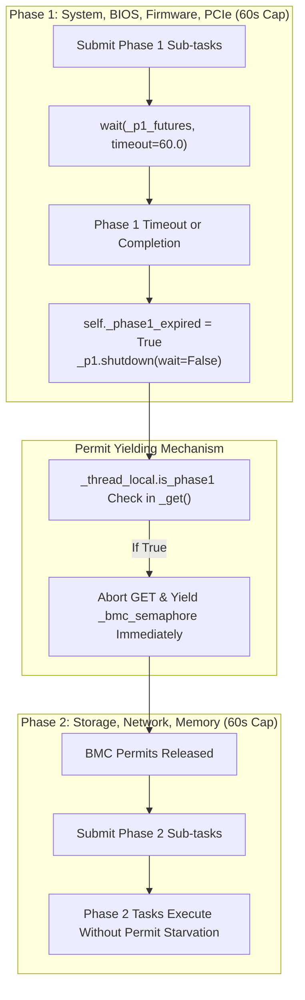
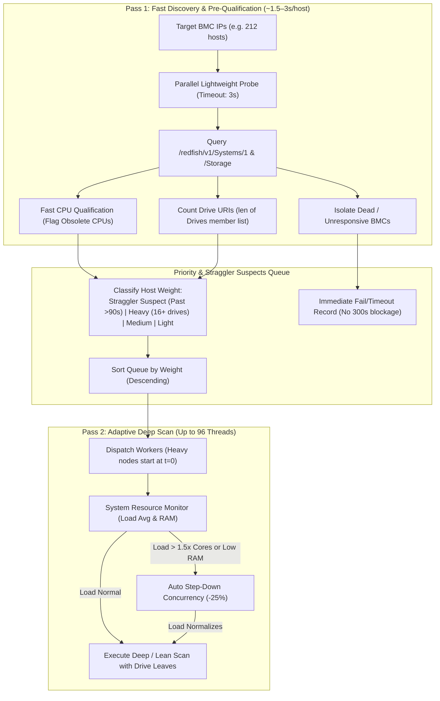
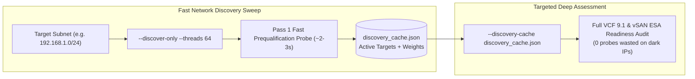

# Redfish Collector Architecture & Scanning Optimizations Reference

> Architectural reference guide for AI code reviewers, engineering contributors, and maintainers working on `groundzero.collector`.
> Documents concurrency models, phase task isolation, adaptive throttling, caching mechanics, and OEM-specific hardware quirks.

---

## 1. System Overview & Two-Tier Concurrency Model

The Redfish collection engine employs a **two-tier concurrency model** designed to maximize fleet scanning throughput while protecting fragile enterprise BMC web servers (iDRAC, iLO, XCC, CIMC) from HTTP request exhaustion.

```
┌─────────────────────────────────────────────────────────────────────────────┐
│ Tier 1: Outer Fleet Executor (groundzero/web/server.py or groundzero/cli.py)      │
│ Default: ThreadPoolExecutor(max_workers=12-20)                              │
└───────────────┬─────────────────────────────────────────────┬───────────────┘
                │ Host 1 (192.168.1.10)                       │ Host 2 (192.168.1.11)
                ▼                                             ▼
┌───────────────────────────────────────────────┐ ┌───────────────────────────┐
│ Tier 2: Condition Variable Inner Concurrency  │ │ Tier 2: Condition         │
│ _BMC_INNER_WORKERS = 3                        │ │ Variable Concurrency      │
│ self._inner_cv = Condition(self._cache_lock)  │ │ self._inner_cv            │
│ self._active_inner_workers: 0..3              │ │ self._active_inner_workers│
└───────────────────────────────────────────────┘ └───────────────────────────┘
```

### Key Concurrency Parameters
* **Outer Fleet Pool:** `ThreadPoolExecutor` running parallel host scans across the IP list. On low-latency enterprise LANs (<80ms RTT), outer concurrency safely scales up to 16–24 (max 32). Over high-latency WAN/VPN connections (>80ms avg RTT), the latency probe automatically auto-adjusts outer concurrency down to 6–8 threads (overrideable via `--force-threads`).
* **Inner BMC Condition Variable Concurrency:** Each `BaseRedfishCollector` instance maintains an inner concurrency controller backed by a `threading.Condition` variable (`self._inner_cv`) using `self._cache_lock` (`threading.RLock`).
* **Active Worker Tracking:** `self._active_inner_workers` tracks concurrent HTTP requests in flight (0 to `_BMC_INNER_WORKERS = 3`, or clamped to `1` when throttled).
* **Zero Permit Leaks:** Unlike `BoundedSemaphore` with background drain threads, the Condition Variable pattern never leaks permits or leaves threads blocked across phase switches.
* **Guardrail:** No single host scan can issue more than 3 simultaneous HTTP GET requests to a single BMC controller, regardless of how many asynchronous sub-tasks are queued.
* **Persistent Connection Pooling:** Each collector operates an internal `StdlibHTTPConnectionPool` managing up to 3 reusable `http.client.HTTPSConnection` instances with HTTP/1.1 Keep-Alive, eliminating repetitive TLS handshakes across 40–80 GETs per host.

---

## 2. Phase Execution & Task Starvation Guardrails

Host scanning runs in two distinct, timed execution phases:
* **Phase 1 (~60s cap):** Basic system summary, BIOS attributes, SEL event log, OS software inventory, BMC security/license, PCIe device tree, and Firmware Inventory.
* **Phase 2 (~60s cap):** Subsystem collectors (Storage controllers/drives, Network adapters, Memory DIMMs, GPU accelerators, FC HBAs, Power/PSUs, Thermal/Telemetry).



### The Permit Starvation Problem & Fix
* **Problem:** If Phase 1 timed out at 60 seconds (due to BMC latency or a long `FirmwareInventory` sweep), background threads from Phase 1 remained active in Python's thread pool and continued making `_get()` calls. Under adaptive throttling (1 worker permit), these lingering Phase 1 threads monopolized the single BMC permit, completely blocking Phase 2 tasks (`storage`, `network`, `memory`) until Phase 2 also timed out.
* **Fix (Phase Isolation & Nested Pool Throttling):**
  1. Phase 1 threads are tagged via thread-local state: `_thread_local.is_phase1 = True`.
  2. Nested worker pools (NIC ports, NDFs, storage drives, DIMMs, PCIe devices) wrap their tasks via `_wrap_phase_task()` so worker threads inherit `is_phase1` / `is_phase2`.
  3. When already running inside a phase worker, nested pools cap `max_workers` at 1 (`_get_phase_worker_count()`) to eliminate thread amplification beyond `_BMC_INNER_WORKERS`.
  4. When Phase 1 completes or reaches its timeout, `self._phase1_expired = True` is set and active inner workers are drained via `self._inner_cv.wait_for(..., timeout=3.0)` before entering Phase 2.
  5. Inside `_get()`, any request originating from a thread where `_thread_local.is_phase1` is True and `self._phase1_expired` is True returns `None` immediately.
  6. This guarantees that Phase 1 background tasks instantly yield BMC permits to Phase 2 tasks upon phase transition.

---

## 3. Adaptive Throttling Mechanics

Enterprise BMC controllers often degrade or drop TLS handshakes when under sustained query load. Adaptive throttling monitors consecutive timeouts and dynamically scales inner concurrency using a Condition Variable without permit leakage.

```
                  ┌─────────────────────────────────────────┐
                  │ Normal State: 3 Active BMC Workers      │
                  │ max_allowed = 3                         │
                  └────────────────────┬────────────────────┘
                                       │
            2 Consecutive Timeouts     │     4 Consecutive 200 OKs
            (socket/SSL timeout)       │     (Successful HTTP GETs)
                                       ▼
                  ┌─────────────────────────────────────────┐
                  │ Throttled State: 1 Active BMC Worker    │
                  │ max_allowed = 1 (self._throttled=True)  │
                  └─────────────────────────────────────────┘
```

### Implementation Highlights (`groundzero/collector/base.py`)
* **Step-Down:** When `_consecutive_timeouts >= 2`, `self._throttled = True`. No background threads are spawned. The condition variable wait loop in `_get()` immediately restricts incoming worker permits to 1.
* **Step-Up:** When `_consecutive_successes >= 4` while throttled, `self._throttled = False` and `self._inner_cv.notify_all()` is invoked, immediately allowing up to 3 workers to run.
* **Phase Transition Guarantee:** At Phase 2 entry, `self._throttled = False` and `self._inner_cv.notify_all()` are executed, ensuring Phase 2 tasks are never starved by earlier Phase 1 timeouts.
* **SSL Handshake Backoff:** When an `SSLError` or `URLError` containing `"handshake"` or `"ssl"` occurs during retry, `time.sleep(2)` is applied before retrying to allow the BMC TLS stack to recover.

---

## 4. OEM Hardware Quirks & Optimization Catalog

### Dell iDRAC
* **FirmwareInventory Duplicate URIs:** Dell iDRAC lists duplicate `Installed-*` items alongside `Current-*` items for every hardware component (e.g. `Current-159-2.21.1__BIOS.Setup.1-1` vs `Installed-159-2.21.1__BIOS.Setup.1-1`).
  * **Optimization (`collect_system.py`):** `collect_firmware_inventory()` filters out `Installed-*` URIs when a matching `Current-*` URI exists for the same component suffix. This reduces firmware GET calls from 50+ down to ~20 with zero loss of physical hardware data.
* **Firmware Priority Sorting:** Remaining firmware URIs are sorted by priority: System/BIOS/iDRAC/CPLD/NIC/Storage Controller URIs (priority 0) are fetched before disk drive firmware URIs (priority 2).
* **PCIe Device Tree Capping:** Dell servers with large expansion backplanes expose 60+ PCIe device URIs under `/Chassis/System.Embedded.1/PCIeDevices`.
  * **Optimization (`collect_gpu.py`):** PCIe member URIs are priority-sorted using `_uri_priority_key()` (slots, integrated NICs, RAID, OCP, GPUs given priority 0; bridges and root ports given priority 2) and capped at **30 items max**, processed in time-bounded chunks with a 15-second total phase cap.

### HPE iLO (iLO 4 / iLO 5 / iLO 6)
* **Embedded LOM Discovery:** HPE iLO 5 exposes physical ALOM cards under `/Chassis/1/NetworkAdapters`, but exposes onboard 1GbE/10GbE LOMs (e.g. HPE 331i 4-port) under `/Systems/1/BaseNetworkAdapters` and `/Systems/1/EthernetInterfaces`.
  * **Optimization (`collect_network.py`):** `f"{self.sys_uri}/BaseNetworkAdapters"` is explicitly included in network endpoints to discover onboard LOMs with full branding, manufacturer (`Hewlett Packard Enterprise`), and part numbers.
* **Sequential Network Device Functions (NDF) Early Break:** In `pci_utils.extract_pci_ids_from_dict()`, querying all 16 `NetworkDeviceFunctions` sequentially per adapter adds ~8s per adapter.
  * **Optimization (`pci_utils.py`):** The loop breaks early as soon as the first function returns valid `VendorId` and `DeviceId`.
* **Transient 503 / Resource Not Ready:** HPE iLO 5 returns `Oem.Hpe.ResourceNotReadyRetry` during background inventory refresh.
  * **Optimization (`oem/hpe.py`):** `oem_handle_retry()` detects this condition, pauses for 3 seconds, and retries the HTTP GET once.

### Supermicro BMC
* **HTML 404 Non-JSON Responses:** Supermicro Lighttpd web servers return HTML 404 pages instead of Redfish JSON error bodies when an endpoint is missing.
  * **Guardrail (`base.py`):** All HTTP response parsing is wrapped in `try ... except json.JSONDecodeError` to prevent crashes.
* **DCMS License Gating:** `/Storage` endpoints on Supermicro BMCs return `OemLicenseNotPassed` unless a DCMS license key is installed.
  * **Optimization (`oem/supermicro.py`):** `_is_license_blocked()` detects license gates and transparently falls back to `/Systems/1/SimpleStorage`.

### Cisco IMC
* **Manager Path Discrepancy:** Cisco IMC uses `/Managers/CIMC` rather than standard `/Managers/1` or `/Managers/iDRAC.Embedded.1`.
  * **Optimization (`oem/cisco.py`):** `oem_manager_paths()` registers `/Managers/CIMC`.
* **Chassis-Level SEL:** LogServices are exposed under `/Chassis/1/LogServices/SEL` rather than the system root.

### Quanta BMC
* **Fast-Path Self Roots:** Quanta BMCs (e.g. QuantaGrid D42A-2U) place system, chassis, and manager roots under `/Systems/Self`, `/Chassis/Self`, and `/Managers/Self`.
  * **Optimization (`oem/quanta.py`):** `oem_fastpath_roots()` probes `/Systems/Self` first, avoiding slow collection member iteration.
* **Storage Endpoint Dedup:** Redfish storage mixin probes `/Storage` automatically.
  * **Optimization (`oem/quanta.py`):** `oem_storage_endpoints()` returns only `/SimpleStorage` to avoid redundant duplicate GETs against `/Storage`.
* **Shallow Crawl Tolerance:** Ingested Quanta mockups omit deep Processor and Storage leaves. The collector gracefully falls back to ProcessorSummary and SimpleStorage without failing the scan.

### GIGABYTE BMC (AMI MegaRAC)
* **Fast-Path Self Roots:** AMI MegaRAC firmware identifies system, chassis, and manager entities under `/Self`.
  * **Optimization (`oem/gigabyte.py`):** `oem_fastpath_roots()` probes `/Systems/Self` first, immediately resolving root URIs.
* **Drive Telemetry Mapping:** Drives expose slot numbers under `Oem.GBT.SlotNumber`.
  * **Optimization (`oem/gigabyte.py`):** `oem_drive_metrics()` extracts slot information from `Oem.GBT` while maintaining backward compatibility with `Oem.Gigabyte`.

---

## 5. Caching Mechanics

`BaseRedfishCollector` maintains two distinct, thread-safe in-memory cache structures per host scan:

```
┌─────────────────────────────────────────────────────────────────────────────┐
│ Positive Request Cache: self._request_cache                                 │
│ Maps exact URL -> parsed JSON dict                                          │
│ Bypasses network GET for duplicate references (e.g., Managers, UpdateService)│
└─────────────────────────────────────────────────────────────────────────────┘

┌─────────────────────────────────────────────────────────────────────────────┐
│ Negative Endpoint Cache: self._negative_endpoints                           │
│ Stores path suffixes that returned HTTP 404 (e.g., /LogServices)            │
│ Fast-bypasses subsequent calls to known non-existent paths on this host     │
└─────────────────────────────────────────────────────────────────────────────┘
```

---

## 6. Tiered Scan Depth Profiles & Trade-off Matrix

| Profile / Setting | Scope & Collection Depth | Duration | Use Case & Guidance |
| :--- | :--- | :--- | :--- |
| **`readiness-full`** (Default) | Exhaustive audit: Phase 1 (BIOS, SEL, Firmware Inventory, PCIe, Licenses) + Phase 2 (Storage, NICs, Memory, DIMM topology, GPUs, HBAs, LLDP, Telemetry). | ~25–60s / host | **Standard for VCF 9.1 Readiness**: produces complete hardware audit and vSAN ESA certification. |
| **`readiness-lean`** (`--lean` / `--profile readiness-lean`) | High-speed audit: Phase 1 + Phase 2 core storage/NICs/memory, skipping historical telemetry logs, secondary member GETs, and extra sensor walks. | ~15–30s / host | **High-Throughput Fleet Audits**: ideal for large enterprise sweeps where vSAN ESA readiness verdict is required without historical metrics. |
| **`inventory-lite`** (`--quick` / `--profile inventory-lite`) | Rapid pre-screening: Systems summary, CPU verdict, Power/Thermal rollup, Storage controller rollup, NIC summary (no deep DIMM/PCIe/FW walk). | ~5–10s / host | **Rapid Pre-Qualification**: instantly filters out obsolete CPU architectures and unsupported platforms. |
| **LAN High Concurrency** (`--threads 16-24`) | Outer fleet concurrency up to 24 workers (max 32), with inner BMC workers locked at 3. | High throughput | Recommended for dedicated 1GbE/10GbE management subnets (<80ms RTT). |
| **VPN / WAN Auto-Throttling** (Auto / `--threads 6-8`) | Latency probe auto-clamps outer concurrency to 6–8 threads when avg RTT > 80ms. | Medium | Prevents connection drops and TCP socket exhaustion over WAN/VPN links. |
| **Allow Partial Scans** (`--allow-partial`) | Harvests valid subsystems even if non-critical endpoints time out. | Resilient | **Always recommended** for large fleets with mixed or degraded BMC health. |

---

## 7. Troubleshooting Slow, Unresponsive, and Partial BMC Scans

Enterprise BMCs are embedded microcontrollers running resource-constrained Real-Time Operating Systems (RTOS) or stripped-down embedded Linux kernels (e.g. Dell iDRAC Linux, HPE iLO ASIC, Supermicro Lighttpd/ATEN). Under heavy polling, background firmware updates, or high fleet concurrency, BMCs can become sluggish or unresponsive.

### 7.1 Diagnostic Symptoms & Root Causes

| Symptom / Log Output | Underlying Root Cause | Impact |
| :--- | :--- | :--- |
| `[⚠️] <host> (Partial Scan (missing: ...))` | Redfish collection timed out during Phase 1 (60s) or Phase 2 (60s). Specific sub-tasks (e.g. storage, NICs, firmware) were cut off to prevent host hanging indefinitely. | Individual host report is marked with `⚠️ Partial (Incomplete)` banner; hardware tables missing data display warning callouts. |
| `[WARN] <host> — BMC latency/timeout detected (2 consecutive timeouts) — stepping down concurrency` | The BMC embedded web server is overwhelmed or dropping connections. The collector dynamically throttles to 1 inner worker. | Scan slows down for this host to avoid tripping BMC DoS protections. |
| `[SECTION ERROR] <host> / firmware_inventory: timed out` | Dell iDRAC or HPE iLO with 60+ firmware inventory endpoints took >60s to enumerate every firmware image. | BIOS and System summary succeed; firmware table reports missing data. |
| `[SECTION ERROR] <host> / storage: timed out` | Controller or drive pass-through query under `/Systems/1/Storage` hung or responded in >60s. | Storage disks and controllers missing from report. |
| `URLError / SSLError: [SSL: BAD_HANDSHAKE_LENGTH]` or Connection reset | BMC TLS session cache exhaustion. The BMC cannot negotiate new SSL handshakes. | Collector applies 2s exponential backoff and retries. |

### 7.2 Remediation Playbook

#### Action 1: Soft-Reset the BMC Controller
A soft-reset restarts the BMC out-of-band processor (iDRAC, iLO, CIMC) without impacting the running host OS, production VMs, or data path.

* **Dell PowerEdge (iDRAC 7/8/9):**
  ```bash
  # Remote via racadm (from admin workstation):
  racadm -r <bmc_ip> -u <user> -p <pass> racreset

  # Or via SSH into iDRAC:
  ssh <user>@<bmc_ip> "racreset"
  ```
  *Wait 2–3 minutes for iDRAC web interface to finish booting before re-scanning.*

* **HPE ProLiant (iLO 4/5/6):**
  ```bash
  # Remote via SSH into iLO:
  ssh <user>@<bmc_ip> "iloreset"

  # Or via hponcfg (from ESXi/Linux host OS):
  hponcfg -r
  ```
  *Wait 90–120 seconds for iLO services to restart.*

* **Supermicro / Intel / Generic IPMI:**
  ```bash
  # Cold reset of BMC management controller:
  ipmitool -I lanplus -H <bmc_ip> -U <user> -P <pass> mc reset cold
  ```
  *Wait ~2 minutes for IPMI/Redfish stack to reinitialize.*

* **Cisco UCS (IMC):**
  ```bash
  # Via SSH into CIMC:
  ssh <user>@<bmc_ip> "scope chassis; scope bmc; reboot"
  ```

#### Action 2: Use the "Retry Incomplete Hosts" Web UI Feature
The Web UI provides a dedicated **"🔄 Retry Incomplete Hosts"** remediation button in the Post-Scan Summary card whenever failed or partial hosts occur:
1. Automatically extracts only the failed and partial scan IP addresses.
2. Applies the **Gentle Retry Profile**:
   * Clamps concurrency threads to **4** (or **2** for small batches) to eliminate network and BMC socket pressure.
   * Extends per-host scan timeout to **10 minutes (600s)**.
   * Ensures **Allow Partial Scans** is enabled.
3. Automatically populates the target range and focuses the Discovery card for immediate re-execution.

#### Action 3: Pre-Scan Latency Probing & VPN Auto-Throttling (v7.0.0+)
The scanner automatically performs a TCP RTT latency probe on candidate target BMCs before scanning begins (`probe_fleet_network_latency()` in `groundzero.protocol`):
* If average RTT > 80ms or maximum RTT > 150ms (indicating WAN or VPN links), concurrency is automatically scaled down to **8 threads** (or fewer) to prevent TCP socket exhaustion.
* If unconstrained thread concurrency is explicitly required across a VPN, pass `--force-threads` on the CLI or `force_threads: True` in the Web API.

#### Action 4: CLI Fleet Tuning Options for Slow BMC Networks
When running from the command line on fleets with known sluggish BMCs or high-latency VPN links:
```bash
# Recommended Gentle Scan Profile:
python groundzero_collector.py \
  --targets targets.txt \
  --threads 4 \
  --host-timeout 600 \
  --allow-partial \
  --combined \
  --output ./scan_results
```
* Use `--two-pass` to run Pass 1 fast discovery and schedule storage-heavy nodes first via Longest-Job-First (LJF).
* Use `--lean` to bypass telemetry and SEL logs if only core hardware compatibility (CPU, RAM, NIC, SSD) is required.
* Use `--quick` for rapid ~5-second pre-assessment CPU family and BIOS qualification.
* Use `--force-threads` to override automatic VPN latency thread-capping.

---

## 7. Two-Pass Discovery & Longest-Job-First (LJF) Priority Scheduling

Large enterprise fleets often feature a heterogeneous mix of lightweight compute nodes (2 drives, ~15s scan time) and storage-dense vSAN nodes (24+ drives, ~180–240s scan time). Standard FIFO dispatch causes the **"Straggler Effect"**, where 24-drive nodes dispatched late in the run force 95 threads to idle while waiting for the tail to finish.



### Key Mechanics
1. **Pass 1 Lightweight Discovery (`groundzero/fleet_discovery.py`):**
   * Issues 2 minimal Redfish GET requests: `/redfish/v1/Systems/1` and `/redfish/v1/Systems/1/Storage`.
   * Fast timeout of 3.0s per request to avoid blocking on unresponsive BMCs.
   * Counts drive URI links in storage controllers without fetching drive leaves.
2. **Historical "Straggler Suspects" Cache:**
   * If a previous scan exists, hosts with past scan duration >90s are tagged as **Priority 0 (Straggler Suspect)** for instant dispatch at $t=0$.
3. **Longest-Job-First (LJF) Dispatch:**
   * All heavy 24-drive nodes are dispatched into the thread pool at $t=0$.
   * While heavy nodes perform drive leaf walks, remaining threads concurrently sweep through medium and light nodes, eliminating the straggler long-tail.

---

## 8. Dynamic System Auto-Stepdown Monitor (`groundzero/system_throttle.py`)

When running high concurrency (e.g. `--threads 96`), the scanner monitors host system health using standard library APIs only (`os.getloadavg()`, `os.cpu_count()`, `/proc/meminfo`):

* **Auto-Stepdown Trigger:** If 1-minute load average exceeds `1.5 * CPU cores` (e.g. load > 12 on an 8-core host) or available RAM falls below 10%, outer worker concurrency is stepped down by 25% (e.g. 96 $\rightarrow$ 72 threads).
* **Auto-Stepup Recovery:** When load average drops below `1.0 * CPU cores` and available RAM exceeds 20%, outer worker permits scale back up to the configured thread target.

---

## 9. Subnet-Wide Out-of-Band Discovery Caching & Inactive Target Pruning

In enterprise datacenters with large subnet allocations (`/24`, `/20`, or `/16`), many IP addresses are unoccupied ("dark") or assigned to non-BMC endpoints. Probing hundreds of unresponsive IPs with full multi-layer HTTP collection wastes significant time and thread permits.

Inspired by discovery caching principles from projects like OpenCHAMI Magellan, the scanner supports decoupled discovery, persistent discovery caching, and inactive target pruning:

### 9.1 Discovery Caching Architecture (`--discovery-cache`, `--discover-only`, `--prune-inactive`)



### 9.2 Key CLI Capabilities
* **Fast Network Discovery Sweep (`--discover-only`):**
  Executes only Pass 1 fast pre-qualification across candidate IP ranges or subnets, prints an ASCII status table of active BMCs with vendor, model, and weight classification, writes `data/discovery_cache.json`, and exits without launching full 5-minute deep host audits.
  ```bash
  python groundzero_collector.py --targets 192.168.1.0/24 --discover-only --threads 32
  ```
* **Persistent Discovery Caching (`--discovery-cache <file>`):**
  Loads active, reachable BMC targets directly from a prior discovery cache JSON file, skipping initial network sweeps and eliminating redundant probing across dark IPs.
  ```bash
  python groundzero_collector.py --discovery-cache ~/Desktop/VCF-Scans/discovery_cache.json --threads 16
  ```
* **Inactive Target Pruning (`--prune-inactive`):**
  When scanning subnets with Pass 1 discovery enabled, automatically filters out dark/unreachable IPs from the Phase 2 deep assessment queue, saving thread workers from timing out on closed ports.


